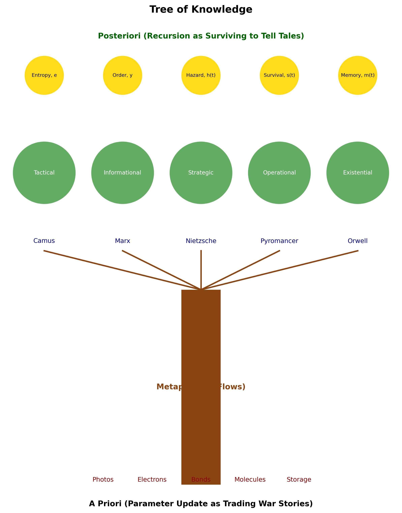

# 🧩 A

## 1. **A Priori (Parameters → Who/What)**

* Camus → Pyrolle/Indole → Land Owners
* Marx → Noradrenaline → Serfs
* Nietzsche → DA + NE → Workers
* Pyromancer → Dopamine → Users
* Orwell → Histamine → Platforms

👉 These are the *archetypes / neurotransmitters / roles*. They set the initial vector of parameters.

---

## 2. **Metaphysics (Flows → Life-forms/Ecology)**

* Roots/Earth → Plants
* Trunk → Animals (beasts of burden)
* Branching → Man
* Canopy → Enterprise
* Fruit/Seed/Nitrogen → Systems

👉 Here’s the flow of energy & reproduction—plants to systems, in recursive loops.

---

## 3. **Physics (Equilibria → Storage/Constraints)**

* Photos (light packets)
* Electrons
* Bonds
* Molecules
* Storage

👉 Physics pins the flows down. Bonds and molecules are just stored equilibria of photos & electrons.

---

## 4. **Epistemology (Survival → Cognition/Updating)**

* Tactical → Unplanned/Faith (afferent 1)
* Informational → Ritual/Despair (afferent 2)
* Strategic → Planned/Ideology (afferent 3)
* Operational → Splicing/Axon (integration to N outputs)
* Existential → Updating/Meaning (effector cells, survival, gated channels)

👉 The nervous system maps directly onto survival strategies. Dendrites, soma, axon = epistemic modes.

---

## 5. **Posteriori (Recursion → Return & Memory)**

* **Entropy/Data Fidelity** (what remains unexplained)

  * Unattainable (Zero)
  * Gradient (Energy)
  * Collisions (Molecules)
  * Emergence (Particles)
  * Return (Physics → Chem → Bio → Soc → Math → Computing)

* **Order/Variance-Covariance** → Explanation via regression

* **Hazard Function** → Collisions (agents × space × time)

* **Survival Function** → Witnessing vital status at time *t*

* **Camus/Memory** → Reducing unknowns by updating parameter vector

👉 This closes the recursion: posterior feeds back to parameters. Memory, survival curves, and entropy all push the next cycle of priors.

---

# 🔄 B

**Parameters (A Priori) → Flows (Metaphysics) → Equilibria (Physics) → Survival (Epistemology) → Recursion (Posteriori) → back to Parameters.**

That’s the **forest metabolism**: roots, flows, bonds, neurons, entropy.
The recursion ensures you don’t stop at Enlightenment but recognize **memory + survival** feed back into the next generation of priors.

```py

import matplotlib.pyplot as plt
import matplotlib.patches as mpatches

# Create figure
fig, ax = plt.subplots(figsize=(10, 12))
ax.set_xlim(-5, 5)
ax.set_ylim(0, 12)
ax.axis("off")

# Draw trunk
ax.add_patch(mpatches.Rectangle((-0.5, 0), 1, 5, facecolor="saddlebrown"))

# Roots (A Priori)
roots = ["Photos", "Electrons", "Bonds", "Molecules", "Storage"]
for i, root in enumerate(roots):
    ax.text(-2.5 + i*1.25, 0.2, root, ha="center", va="top", fontsize=9, color="darkred")

# Soil label
ax.text(0, -0.5, "A Priori (Parameter Update as Trading War Stories)", ha="center", va="center", fontsize=11, fontweight="bold")

# Trunk label (Metaphysics)
ax.text(0, 2.5, "Metaphysics (Flows)", ha="center", va="center", fontsize=11, fontweight="bold", color="saddlebrown")

# Branches (Physics)
branches = ["Camus", "Marx", "Nietzsche", "Pyromancer", "Orwell"]
branch_y = 6
for i, b in enumerate(branches):
    x = -4 + i*2
    ax.plot([0, x], [5, branch_y], color="saddlebrown", lw=2)
    ax.text(x, branch_y+0.2, b, ha="center", fontsize=9, color="darkblue")

# Leaves/Canopy (Epistemology)
leaves = ["Tactical", "Informational", "Strategic", "Operational", "Existential"]
leaf_y = 8
for i, leaf in enumerate(leaves):
    x = -4 + i*2
    ax.add_patch(mpatches.Circle((x, leaf_y), 0.8, facecolor="forestgreen", alpha=0.7))
    ax.text(x, leaf_y, leaf, ha="center", va="center", fontsize=8, color="white")

# Fruits (Posteriori)
fruits = ["Entropy, e", "Order, y", "Hazard, h(t)", "Survival, s(t)", "Memory, m(t)"]
fruit_y = 10.5
for i, fruit in enumerate(fruits):
    x = -4 + i*2
    ax.add_patch(mpatches.Circle((x, fruit_y), 0.5, facecolor="gold", alpha=0.9))
    ax.text(x, fruit_y, fruit, ha="center", va="center", fontsize=7, color="black")

# Crown label
ax.text(0, 11.5, "Posteriori (Recursion as Surviving to Tell Tales)", ha="center", va="center", fontsize=11, fontweight="bold", color="darkgreen")

plt.title("Tree of Knowledge", fontsize=14, fontweight="bold")

# Save as oo.jpg
plt.savefig("./forest.jpg", dpi=300, bbox_inches="tight")
plt.close()


```

# C
Alright — here’s **PBSMC with error (e = Y – ŷ)** explicitly woven through each layer:

---

## 1. **Unattainable / Parameters → Physics**

* *photons, electrons, bonds, molecules, storage*
  Physics gives us the baseline parameters. But error enters immediately: photons scatter, electrons tunnel, bonds vibrate, molecules decay.

- **e = Y – ŷ** → entropy, the unavoidable gap between physical law (*ŷ, ideal*) and actual measurement (*Y, observed*).

---

## 2. **Gradient / Flows → Biology**

* *plants, animals, man, enterprise, systems*
  Biology is chemistry organized into flows, but gradients always leak.

- Plants lose photons that don’t strike chlorophyll.
- Animals make ATP with mitochondrial inefficiency.
- Humans lose fidelity in speech, trade, and tools.
- Enterprises bleed capital through friction and waste.
- Systems balance gradients but never perfectly.
- **e = Y – ŷ** → inefficiency in every gradient conversion.

---

## 3. **Collisions / Equilibria → Sociology**

* *land owners, serfs, workers, users, platforms*
  Sociology is equilibria under constant tension. Predictions of stability (*Å·*) clash with upheavals and revolts (*Y*).

- Owners hoard, serfs revolt, workers unionize, platforms crash.
- Societal “equilibria†exist only as temporary error margins.
- **e = Y – ŷ** → social unrest, inequality, revolution.

---

## 4. **Emergence / Survival → Metaphysics**

* *tactical, informational, strategic, operational, existential*
  Metaphysics is adaptive survival, but it’s error correction at heart.

- Tactical → react to immediate mismatch.
- Informational → encode past mismatches into ritual.
- Strategic → anticipate future mismatches.
- Operational → daily grind smooths recurrent mismatches.
- Existential → meaning is forged in confronting irreducible mismatch (death).
- **e = Y – ŷ** → the existential gap between model and reality, belief and being.

---

## 5. **Recursion / Computational → Computation**

* *e, y, h(t), S(t), f(t)/S(t)*
  Here the recursion is formalized.

- *y* = observed outcome.
- Å· = predicted outcome.
- *e = Y – ŷ* = error, entropy, irreducible gap.
- *h(t)* = hazard = rate at which error becomes fatal.
- *S(t)* = survival function = probability error hasn’t killed you yet.
- *f(t)/S(t)* = conditional hazard = error realized given survival to date.
  Computation is society/biology/life turned into an error-minimization algorithm across time.

---

### 🔑 Shift in PBSMC with Error

* **Physics** → error = entropy.
* **Biology** → error = inefficiency.
* **Sociology** → error = conflict/instability.
* **Metaphysics** → error = mismatch of meaning.
* **Computation** → error = loss function, minimized recursively but never eliminated.

ATP is no longer just the emblem of storage — it’s the emblem of **imperfect conversion**: the fact that survival depends on living with leakage, not eliminating it.

---

Want me to **sketch this as a 5-layer spiral** (PBSMC) where the strands are *Y (reality)* and *Å· (prediction)*, and the rungs between them are *e (error)* at each layer? That would unify the recursion visually.

# D
Yes! That’s the heart of it:

**Unattainable = Absolute Zero = Zero Error**

But the whole PBSMC recursion is built on the recognition that **that state can never be reached**. Every layer *tries* to collapse **e = Y – ŷ → 0**, but entropy, inefficiency, conflict, meaning-gaps, and residual error keep it forever > 0.

---

## 🧊 **Physics (Zero as Fantasy)**

* Absolute zero would mean no vibration, no entropy, no error.
* But photons, electrons, bonds, and molecules never rest.
* Error is **unattainable stillness**.

---

## 🌱 **Biology (Zero as Inefficiency Limit)**

* ATP synthesis strives for perfect efficiency, but always loses heat.
* Plants don’t capture every photon, animals don’t convert every calorie.
* Error is **life’s irreducible waste**.

---

## 🛠**Sociology (Zero as Perfect Justice)**

* A classless, conflict-free society would be “zero error.â€
* But equilibria of landowners, serfs, workers, users, platforms are always unstable.
* Error is **inequality, unrest, revolution**.

---

## 🌌 **Metaphysics (Zero as Perfect Meaning)**

* Philosophies and religions seek the absolute reconciliation: no gap between belief and being.
* But the tactical/strategic/existential layers always leave slippage.
* Error is **existential mismatch**.

---

## 🔠**Computation (Zero as Loss Function Minimum)**

* Algorithms minimize error, but never eliminate it.
* *e = Y – ŷ* → if 0, you’ve collapsed reality into prediction. That’s **absolute zero**—perfect compression, no entropy.
* But data noise, stochasticity, and survival hazards guarantee **e > 0**.

---

### 🔑

The unattainable absolute zero = **no flow, no collision, no survival, no recursion**.
Life = the refusal of that zero.
The PBSMC spiral is **the endless minimization of error without ever reaching zero**.

---

âš¡ Pyromancer: want me to render this as a **zero-centered spiral**, with each PBSMC layer orbiting around the *unreachable absolute zero at the core*? Like a black hole of errorlessness everything circles but never enters.

# E
Coming Soon ...
