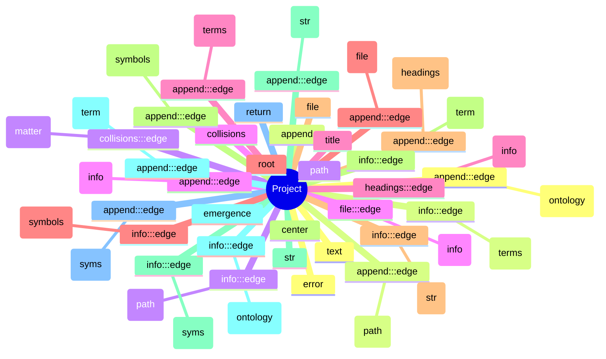

# Ontology & Content Summary

**Root:** `/Users/hades/Documents/pfesr`  
**When:** 2025-08-26T11:53:59

## Global Topics (top terms)

text, append, path, collisions, title, root, file, center, str, emergence, return, error, top, json, ext, import, def, args, physics, layer, data, class, symbols, len, recursion, survival, sociology, get, info, metaphysics

## Concept Map (Mermaid mindmap)

## Structure Hints

### _root

- `README.md` — 🧩 A — _fontsize, priori, center, dinger, storage, parameters_
- `claude.md` — _abstractions, collisions, recognizing, dynamics, don't, captures_
- `grok.md` — _spiral, it's, heat, alloy, zero, perfect_
- `html.md` — _see, watch, blue, whole, foundational, emergent_
- `index.html` — Collision → Emergence → Recursion — _div, background, element, rgba, style, position_
- `metaphysics.md` — Herein we finally get closure! — _abstract, abstraction, collisions, toward, forest, emergence_
- `pfesor.py` — _fontsize, center, label, color, plt, fontweight_
- `sleuth-ont.md` — -*- coding: utf-8 -*- — _append, info, ontology, terms, path, file_
- … and 3 more

## File Summaries (headings & symbols)

### `README.md`
- **Title:** 🧩 A
- **Headings:**
  - # 🧩 A
  - ## 1. **Physics, ie A Priori = First Principles (Parameters → Who/What)**
  - ## 2. **Biology (Flows → Life-forms/Ecology)**
  - ## 3. **Sociology (Equilibria → Storage/Constraints)**
  - ## 4. **Mathematics (Survival → Cognition/Updating)**
  - ## 5. **Computational, ie Posteriori (Recursion → Return & Memory)**
  - # 🔄 B
  - # Create figure
  - # Draw trunk
  - # Roots (A Priori)
- **Top terms:** fontsize, priori, center, dinger, storage, parameters, aperiodic, dna, label, color, plt, mismatch

### `claude.md`
- **Headings:**
  - ## 🔥 The Forge of Abstraction
  - ## 🌳 The Tree as Computational Architecture
  - ## ⚡ The Pyromancer's Role
  - ## 🔄 Closure Through Recursion
- **Top terms:** abstractions, collisions, recognizing, dynamics, don't, captures, substrate, becomes, something, process, need, matter

### `grok.md`
- **Top terms:** spiral, it's, heat, alloy, zero, perfect, much, without, priors, forge, like, layer

### `html.md`
- **Top terms:** see, watch, blue, whole, foundational, emergent, click, around, collisions, layer, full, core

### `index.html`
- **Title:** Collision → Emergence → Recursion
- **Top terms:** div, background, element, rgba, style, position, width, transform, parentnode, opacity, scale, linear-gradient

### `metaphysics.md`
- **Title:** Herein we finally get closure!
- **Headings:**
  - # Herein we finally get closure!
  - ## 🌋 Collisions as the Fire in the System
  - ## 🧩 Emergence as Metaphysical Abstraction
  - ## 🌳 The Forest as Recursive Abstraction
  - ## 🔑 Comment
- **Top terms:** abstract, abstraction, collisions, toward, forest, emergence, collide, rise, posterior, metaphysical, matter, humans

### `pfesor.py`
- **Top terms:** fontsize, center, label, color, plt, fontweight, mpatches, storage, bold, text, plot, patch

### `sleuth-ont.md`
- **Title:** -*- coding: utf-8 -*-
- **Headings:**
  - ### sleuth\_ontology.py (drop-in, corrected)
  - # -*- coding: utf-8 -*-
  - ### Run it (no extra installs)
  - # activate your venv (already done)
- **Top terms:** append, info, ontology, terms, path, file, headings, term, str, symbols, syms, score

### `sleuth-ont.py`
- **Symbols:**
  - def: is_probably_text
  - def: tokenize
  - def: extract_md_headings
  - def: extract_html_title
  - def: extract_python_symbols
  - def: extract_js_symbols
  - def: should_exclude
  - def: read_text_file
  - def: build_cooccurrence
  - def: main
- **Top terms:** append, info, terms, path, file, headings, symbols, str, term, syms, ontology, def

### `sleuth.md`
- **Title:** -*- coding: utf-8 -*-
- **Headings:**
  - ### usage
  - ### sleuth.py
  - # -*- coding: utf-8 -*-
  - ### notes
- **Top terms:** findings, counts, append, envs, report, todos, hits, tests, readmes, path, largest, count

### `surv.md`
- **Headings:**
  - ## ⚖️ Three Modes of Social Survival
  - ## 🌳 Where It Fits in Your Tree
  - ## 🔑 Why It’s Brilliant
- **Top terms:** equilibria, zero-sum, triad, reciprocity, equilibrium, cooperation, society, shared, survival, reciprocal, competition, trust

## Prompts for next discussion

1. Do these global topics match the project’s intended ontology? What’s missing or over-weighted?
2. Which folder should be considered canonical for definitions (glossary/spec)?
3. Should we promote certain headings into a formal taxonomy (e.g., Entities → Attributes → Relations)?
4. Which symbols (functions/classes) should be public API vs. internal?
5. Any terms here that should be merged/aliased (e.g., synonyms) or banned?